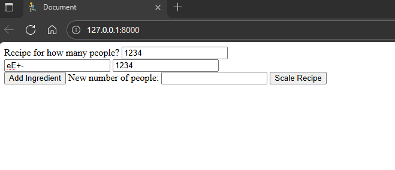
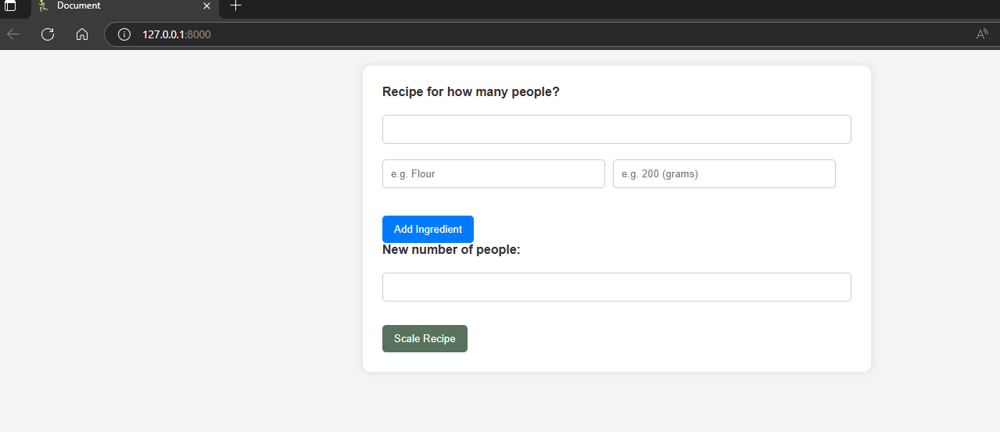

# Beechy Milestone 2
- [Recipe Wizard](https://beechy-92.github.io/beechy-milestone-2/)

# Project Overview
This project is a recipe scaling tool that allows users to input a recipe, including ingredients and serving size, and then scale the recipe for a different number of servings. It also provides local suggestions for basic ingredients preparation and improvements.


  ## Features I want
  
  **User input**
  - List of ingredients + quantity
  - Original number of servings
  
  **User output**
  - Choose how many servings the user needs
  - Get updated ingredient amounts
  
  **Bonus with API/Future improvements**
  - Suggested alternatives, tips, or improvments (based on recipe ingredients)

## Tech Stack Being Used
  | Part                  | Tech                           |
| --------------------- | ------------------------------ |
| Structure             | HTML                           |
| Styling               | CSS and Bootstrap              |
| Logic + Interactivity | JavaScript                     |
| Suggestions API       | OpenAI |

## Key Javascript Features

**Ingredient Management**
- Users can add new ingredients dynamically  
- Prevents adding a new ingredient if the previous one is empty  
- Each ingredient row has:
  - `.ingredient-name` → text input for ingredient name  
  - `.ingredient-original` → number input for original amount  
  - `.ingredient-scaled` → read-only input for scaled amount  

**Scaling Ingredients**
- Ingredients are scaled based on: scaledAmount = (originalAmount / originalServings) * newServings
- Supports live scaling as the user types a new number of servings  

**Input Validation**
- Original and new servings must be valid positive numbers  
- Blocks invalid number inputs: `e`, `E`, `+`, `-`  
- Alerts user if an ingredient amount is invalid  

**Suggestions System**
- Provides tips for ingredients using a local `suggestionData` object  
- Updates dynamically as ingredient names are typed  
- Basic local suggestions for common ingredients, with plans to use an AI API in the future.

**Reset Functionality**
- Clears all scaled amounts and new servings input  

---

## Development Life Cycle

The development of **Beechy Milestone 2** followed a structured, iterative process to ensure functionality, usability, and maintainability.

### 1. Planning & Research
- Defined the core goal: Create a tool to scale recipes based on serving size.
- Identified required features:
  - Recipe name and ingredient inputs.
  - Original vs new servings scaling.
  - Local suggestions system.
  - Optional API integration for tips.
- Reviewed similar recipe scaling tools for inspiration.
- Chose tech stack: HTML, CSS/Bootstrap, JavaScript, optional OpenAI API.

### 2. Design
- Created initial wireframe for layout.  
- Designed a form-based interface with clearly separated sections for:
  - Recipe info.
  - Ingredient list.
  - Scaling controls.
  - Suggestions.
- Considered responsive design for mobile and desktop.
- Defined color scheme and basic typography.

### 3. Development
- **Phase 1:** HTML structure for form, ingredient rows, and suggestion area.
- **Phase 2:** JavaScript logic for:
  - Adding/removing ingredient rows.
  - Scaling amounts based on serving size.
  - Preventing invalid inputs.
  - Providing local ingredient tips.
- **Phase 3:** CSS/Bootstrap styling for responsive and clean layout.
- **Phase 4:** Integration of suggestion system and live updates.
- Frequent commits to GitHub with meaningful messages after each feature or fix.

### 4. Testing
- Conducted manual testing after each major feature:
  - Input validation tests.
  - Scaling formula verification.
  - Live scaling functionality.
  - UI/UX flow adjustments based on feedback.
- Tested across browsers (Chrome, Firefox, Edge) and devices.
- Logged testing outcomes with screenshots and videos (see Testing section).

### 5. Deployment
- Deployed to GitHub Pages for public access.
- Verified responsiveness and functionality on live site.
- Ensured all assets (images, videos, stylesheets) loaded correctly.

### 6. Maintenance & Future Enhancements
- Planned for possible API integration for advanced suggestions.
- Ideas for future:
  - Save and load recipes, including a function for adding recipe name.
  - User accounts to store preferences.
  - Unit conversions (e.g., cups ↔ grams).
  - Accessibility improvements.

---

## User Stories

- **Steph** – *As a home baker, I want to quickly scale my recipe ingredients so that I can make a cake for a larger party without manually calculating amounts.*  
- **Abby** – *As a busy senior manager, I want to reduce the serving size for my recipes so that I can prepare smaller meals and reduce food waste.*  
- **Teresa** – *As an excellent cook from Hong Kong, I want the system to give me preparation tips for each ingredient so that I can adapt recipes to suit local tastes and cooking styles.*
- **Ashley** - As a web development student, I want to build a recipe scaling app so that I can demonstrate my ability to design a responsive, interactive front-end project that solves a real-world problem.

## Developers Rational

I chose to build the Recipe Scaling Wizard because it solves a common, real-world problem: adapting recipes to suit different serving sizes without manual calculations. Scaling recipes is something that many people — from home cooks to professionals — encounter regularly, and existing solutions are often hidden behind paywalls or overly complicated apps.

From a developer’s perspective, this project was also chosen because it allowed me to:

- Apply core front-end skills: HTML for structure, CSS/Bootstrap for design, and JavaScript for logic and interactivity.
-Demonstrate problem-solving: implementing dynamic ingredient rows, handling invalid inputs, and providing real-time scaling feedback.
- Focus on accessibility and UX: ensuring that the app is clear, easy to navigate, and responsive across devices.
- Explore APIs and advanced interactivity: by planning (and partially implementing) a system for ingredient suggestions and preparation tips.
- Follow professional workflows: using GitHub for version control, documenting commits, testing features, and deploying via GitHub Pages.

By combining both technical learning goals and practical user needs, the Recipe Scaling Wizard demonstrates not just my ability to build a functional app, but also my ability to design with a purpose.

## Testing
  ### Javascript Testing
  * Scale button pressed created an alert when no data was entered 
  * Add ingredients button pressed with no data resulted in no alert 
  * Add ingredients button pressed with no data resulted in no alert again 
  * Add ingredients button pressed with no data resulted in alert 
  * Numbers only test failed because "e" is a scientific numerical value 
  * Numbers only test passed 
  * Input test passed before and after  
  * Live scaling unable to be tested as my original input needs to be seprated from scaled display 
  * Local Smart suggestion introduced and tested 
  
  ### CSS Testing
  * Basic CSS testing to make sure i have set up my style.css file correctly 
  * Inital concept of my CSS, main problem is the ingredient box sizing 
  * Inital concept of my CSS fixed ingredients box 

  ### UX Testing
  * The location of the new number of people doesn't seem to flow very well, so im going to move this towards the top next to the original, this should improve the UI and therfore improving the UX 
  * Live scaling test passed <video controls src="assets/videos/live-scaling-test.mp4" title="Title"></video>

  ### Final Testing (Browser Compatibility)
  * Chrome user test - Testing all functions, inputs and outputs. <video controls src="assets/deployment-images/final-test-chrome.mp4" title="Title"></video>

  * Firefox user test - Testing all functions, inputs and outputs. <video controls src="assets/deployment-images/final-test-firefox.mp4" title="Title"></video>
  
  ### 

  **Key Design Notes**
- Ingredient rows are dynamically added below the last entry  
- Original amounts are editable; scaled amounts are read-only  
- Suggestions list updates live based on ingredient names  
- Buttons are positioned for clear user flow (Scale/Reset/Add Ingredient)  
- Focus and blur effects highlight active inputs for better UX
```
+----------------------------------------------------+
| Original Servings: [] New Servings: [] |
+----------------------------------------------------+
| Ingredients: |
| +--------------------------------------------+ |
| | Ingredient Name: [_______] Original: []|
| | Scaled Amount: [] |
| +--------------------------------------------+ |
| | Ingredient Name: [_______] Original: []|
| | Scaled Amount: [] |
| +--------------------------------------------+ |
| | ... | |
+----------------------------------------------------+
| [+ Add Ingredient] [Scale Recipe] [Reset] |
+----------------------------------------------------+
| Suggestions: |
| - Reduce sugar slightly if making for kids |
| - Soften butter before mixing for better texture|
| - ... |
+----------------------------------------------------+
```


## Legend / Notes 

### Original Servings / New Servings
- Input fields to scale ingredients.  

### Ingredients Section

#### Ingredient Name
- Name of the ingredient.  

#### Original
- Quantity based on original servings.  

#### Scaled Amount
- Automatically calculated based on new servings.  

### Buttons

#### Add Ingredient
- Adds a new ingredient row.  

#### Scale Recipe
- Calculates scaled amounts.  

#### Reset
- Clears scaled amounts and new servings.  

### Suggestions
- Optional tips or alternatives based on entered ingredients.  


# beechy-milestone-2